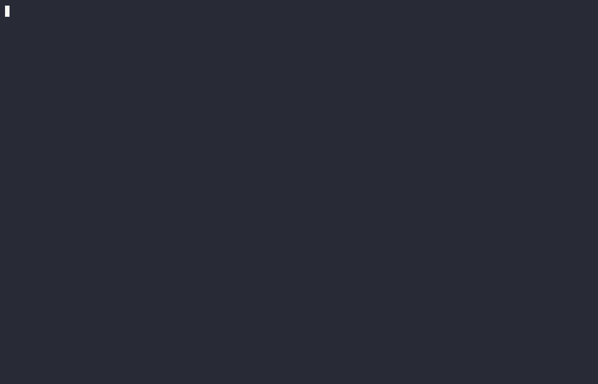

<p align="center">
  <a href="#"></a>
  <h1 align="center">kclipper</h1>
</p>

<p align="center"><i>KCL + Helm = kclipper</i></p>

## Overview

[KCL](https://github.com/kcl-lang/kcl) is a constraint-based record & functional language mainly used in cloud-native configuration and policy scenarios. It is hosted by the Cloud Native Computing Foundation (CNCF) as a Sandbox Project. The KCL website can be found [here](https://kcl-lang.io/).

Kclipper combines [KCL](https://github.com/kcl-lang/kcl) and [Helm](https://helm.sh/) by wrapping KCL with additional [plugins](https://www.kcl-lang.io/docs/next/reference/plugin/overview) and commands, and by providing [packages](https://www.kcl-lang.io/docs/next/user_docs/concepts/package-and-module) which act as friendly plugin interfaces.

Learn how kclipper compares to Holos and other KCL Helm plugins [here](docs/comparison.md).

To use kclipper, you must [install](#installation) it as a KCL replacement. Kclipper is a superset of KCL; all upstream KCL commands, packages, etc., are preserved. Docker images for x86 and arm64 are also available, which allow kclipper to be used as an [Argo CD](https://argoproj.github.io/cd/) Config Management Plugin.

## Features

**Render Helm charts directly within KCL**; take full control of all resources both pre- and post-rendering. Use KCL to its full potential within the Helm ecosystem for powerful and flexible templating, especially in multi-cluster scenarios where ApplicationSets and/or abstract interfaces similar to [konfig](https://github.com/kcl-lang/konfig) are heavily utilized:

```py
import helm
import manifests
import regex
import charts.podinfo

env = option("env")

_podinfo = helm.template(podinfo.Chart {
    valueFiles = [
        "values.yaml",
        "values-${env}.yaml",
    ]
    values = podinfo.Values {
        replicaCount = 3
    }
    postRenderer = lambda resource: {str:} -> {str:} {
        if regex.match(resource.metadata.name, "^podinfo-service-test-.*$"):
            resource.metadata.annotations |= {"example.com/added" = "by kcl patch"}
        resource
    }
})

manifests.yaml_stream(_podinfo)
```

---

**Declaratively manage all of your Helm charts and their schemas.** Choose from a variety of available schema generators to enable validation, auto-completion, on-hover documentation, and more for both Chart and Value objects, as well as `values.yaml` files (if you prefer YAML over KCL for values, or want to use both). Optionally, use the `kcl chart` command to make quick edits from the command line:

```py
import helm

charts: helm.Charts = {
    # kcl chart add -c podinfo -r https://stefanprodan.github.io/podinfo -t "6.7.0"
    podinfo: {
        chart = "podinfo"
        repoURL = "https://stefanprodan.github.io/podinfo"
        targetRevision = "6.7.0"
        schemaGenerator = "AUTO"
    }
    # kcl chart add -c app-template -r https://bjw-s.github.io/helm-charts/ -t "3.6.0"
    app_template: {
        chart = "app-template"
        repoURL = "https://bjw-s.github.io/helm-charts/"
        targetRevision = "3.6.0"
        schemaValidator = "KCL"
        schemaGenerator = "CHART-PATH"
        schemaPath = "charts/common/values.schema.json"
    }
}
```

---

**Automate updates to all KCL and JSON Schemas**, in accordance with your declarations:



---

**Enjoy blazing-fast reconciliation times.** Kclipper is built with performance in mind and is optimized for speedy rendering at runtime. It achieves this with a custom Helm template implementation, based on the Argo CD Helm source implementation, with edits to minimize I/O. Additionally, using schemaValidator="KCL" disables Helm's value validation and instead relies on KCL for values validation. This can provide a significant performance boost for any chart that includes a proper JSON Schema, and is especially noticeable for charts with nested JSON Schemas (e.g., remote refs, chart dependencies, or both).

| Chart        | Vanilla Argo CD | kclipper   | kclipper (schemaValidator=KCL) |
| :----------- | :-------------- | :--------- | :----------------------------- |
| podinfo      | 9.1 ms/op       | 0.78 ms/op | 0.76 ms/op (~12x)              |
| app-template | 159 ms/op       | 143 ms/op  | 1.48 ms/op (~107x)             |

> Approximate values from my Mac Mini M2.

There is a bit of a trade-off. The binary size is larger, and KCL initialization will be slower by an small, absolute amount of time. Meaning, KCL runs with no Helm templates will be slightly slower compared to upstream KCL. See [benchmarks](./benchmarks) for more details.

---

**Pairs excellently with [konfig](https://github.com/kcl-lang/konfig)**. Mix and match your Helm chart definitions with other resources like NetworkPolicies, ExternalSecrets, and more. Manage your entire application with a simple, fully-typed frontend interface and intelligently share configuration between resources:

```py
import tenant
import konfig.models.frontend
import konfig.models.templates.networkpolicy
import konfig.models.utils
import charts.grafana_operator
import grafana_operator.v1beta1 as grafanav1beta1

appConfiguration: frontend.App {
    name = "grafana"
    charts.grafanaOperator = grafana_operator.Chart {
        values = grafana_operator.Values {
            resources.requests = {
                cpu = "10m"
                memory = "50Mi"
            }
        }
    }
    secretStore = tenant.secretStores.default.name
    externalSecrets.grafana = frontend.ExternalSecret {
        name = "grafana-credentials"
        data.GRAFANA_ADMIN_USER = {
            ref: "grafana-admin-username"
        }
        data.GRAFANA_ADMIN_PASS = {
            ref: "grafana-admin-password"
        }
    }
    extraResources.grafanaFoo = grafanav1beta1.Grafana {
        metadata.name = "grafana-foo"
        spec.config = utils.GrafanaConfigBuilder(domainName, "foo")
    }
    extraResources.grafanaBar = grafanav1beta1.Grafana {
        metadata.name = "grafana-bar"
        spec.config = utils.GrafanaConfigBuilder(domainName, "bar")
    }
    networkPolicies = {
        denyDefault = networkpolicy.denyDefault
        kubeDNSEgress = networkpolicy.kubeDNSEgress
        kubeAPIServerEgress = networkpolicy.kubeAPIServerEgress | {
            endpointSelector.matchExpressions = [{
                key = "app.kubernetes.io/name"
                operator = "In"
                values = ["grafana-operator"]
            }]
        }
    }
}
```

## Installation

> :warning: You should not currently use kclipper in multi-tenant Argo CD environments. See [#2](https://github.com/MacroPower/kclipper/issues/2).

Binaries are posted in [releases](https://github.com/MacroPower/kclipper/releases). Images and OCI artifacts are available under [packages](https://github.com/MacroPower/kclipper/pkgs/container/kclipper).

The binary name for kclipper is still just `kcl`, so it can be used as a drop-in replacement for official KCL binaries. Versions are tagged independently of upstream KCL, e.g. kclipper `v0.1.0` maps to kcl `v0.11.0`, but kclipper releases still follow semver with consideration for upstream KCL changes.

To use kclipper with Argo CD, you can follow [this guide](https://www.kcl-lang.io/docs/user_docs/guides/gitops/gitops-quick-start) to set up the KCL ConfigManagementPlugin. You just need to substitute the official kcl image with a kclipper image.

## Usage

> This guide assumes you are fully utilizing plugins, packages, and the kcl chart CLI. If you only want to use a subset of these, please see the extension docs for [OS](./docs/os_extensions.md), [HTTP](./docs/http_extensions.md), and [Helm](./docs/helm_extensions.md).

First, navigate to your project directory. If you don't have a KCL project set up yet, you can run the following command:

```bash
kcl mod init
```

We now have the following project structure:

```
.
├── kcl.mod
├── kcl.mod.lock
└── main.k
```

Now, we can initialize a new `charts` package:

```bash
kcl chart init
```

This should result in a project structure similar to the following:

```
.
├── charts
│   ├── charts.k
│   ├── kcl.mod
│   └── kcl.mod.lock
├── main.k
├── kcl.mod
└── kcl.mod.lock
```

The important note is that the `charts` package is available to your KCL code, but is in its own separate package. You should not try to combine packages or write your own code inside the `charts` package, other than to edit the `charts.k` file.

The `charts.k` file will have no entries by default.

```py
import helm

charts: helm.Charts = {}
```

You can add a new chart to your project by running the following command:

```bash
kcl chart add -c podinfo -r https://stefanprodan.github.io/podinfo -t "6.7.0"
```

This command will automatically add a new entry to your `charts.k` file, and generate a new `podinfo` package in your `charts` directory.

> :warning: Everything in the chart sub-packages, `podinfo` in this case, is auto-generated, and any manual edits will be lost. If you need to make changes, you should do so in the `charts.k` file, or in your own package that imports the `podinfo` package (e.g. via overriding attributes).

Your project structure should now look like this:

```
.
├── charts
│   ├── charts.k
│   ├── kcl.mod
│   ├── kcl.mod.lock
│   └── podinfo
│       ├── chart.k
│       ├── values.schema.json
│       └── values.schema.k
├── main.k
├── kcl.mod
└── kcl.mod.lock
```

And your `charts.k` file will have a new entry for the `podinfo` chart:

```py
import helm

charts: helm.Charts = {
    podinfo: {
        chart = "podinfo"
        repoURL = "https://stefanprodan.github.io/podinfo"
        targetRevision = "6.7.0"
        schemaGenerator = "AUTO"
    }
}
```

> Note that keys and folder/package names will be valid KCL identifiers, whereas the chart argument is the name of the Helm chart. Typically these will be the same, but for example an `app-template` chart will have a key and folder/package named `app_template`.

The `charts.podinfo` package will contain the schemas `podinfo.Chart` and `podinfo.Values`, as well as a `values.schema.json` file for use with your `values.yaml` files, should you choose to use them. You can now use these objects in your `main.k` file:

```py
import helm
import charts.podinfo

_podinfo = helm.template(podinfo.Chart {
    values = podinfo.Values {
        replicaCount = 3
    }
})

manifests.yaml_stream(_podinfo)
```

Here, `_podinfo` is a list of Kubernetes resources that were rendered by Helm. You can use the `manifests` package to render these resources to a stream of YAML, which can be piped to `kubectl apply -f -`, be used in a GitOps workflow e.g. via an Argo CMP, etc.

In a real project, you might want to abstract away rendering of the output, package charts with other resources, and so on. For an example, I am using kclipper in my [homelab](https://github.com/MacroPower/homelab/tree/main/konfig), using the [konfig](https://github.com/kcl-lang/konfig) pattern. In this case, a frontend package defines inputs for charts, a mixin processes those inputs, and a backend package renders the resources.

### Chart Updates

When you want to update a chart, you can edit the `charts.k` file like so:

```diff
 import helm

 charts: helm.Charts = {
     podinfo: {
         chart = "podinfo"
         repoURL = "https://stefanprodan.github.io/podinfo"
-        targetRevision = "6.7.0"
+        targetRevision = "6.7.1"
         schemaGenerator = "AUTO"
     }
 }
```

Or, alternatively, you can run the following command (wraps KCL automation):

```bash
kcl chart set -c podinfo -O targetRevision=6.7.1
```

Then run re-generate the `charts.podinfo` package to update the schemas:

```bash
kcl chart update
```

Likewise, the same applies to any other changes you may want to make to your Helm charts. For example, you could change the `schemaGenerator` being used, or add or remove a chart from the `charts` dict.

### Schema Generators

The following schema generators are currently available:

| Name            | Description                                                                           |   Parameters |
| :-------------- | :------------------------------------------------------------------------------------ | -----------: |
| AUTO            | Try to automatically select the best schema generator for the chart.                  |              |
| VALUE-INFERENCE | Infer the schema from one or more values.yaml files (uses [helm-schema][helm-schema]) |              |
| URL             | Use a JSON Schema file located at a specified URL.                                    | `schemaPath` |
| CHART-PATH      | Use a JSON Schema file located at a specified path within the chart files.            | `schemaPath` |
| LOCAL-PATH      | Use a JSON Schema file located at a specified path within the project.                | `schemaPath` |

`AUTO` is generally the best option. It currently looks for `values.schema.json` files in the chart directory (i.e. `CHART-PATH` with `schemaPath: "values.schema.json"`), and falls back `VALUE-INFERENCE` if none are found.

[helm-schema]: https://github.com/dadav/helm-schema

### Referencing Values

You may find yourself wanting to define some values in a values.yaml file, either due to personal preference or because you don't want to copy or import a large set of values into KCL. In any case, you can use the `values.schema.json` file like so:

```yaml
# yaml-language-server: $schema=./charts/podinfo/values.schema.json

replicaCount: 3
# ...
```

Where `$schema` defines a relative path from the `values.yaml` file to the `values.schema.json` file.

Then, use the `valueFiles` argument, again with a relative path to the values.yaml file:

```py
import helm
import charts.podinfo

_podinfo = helm.template(podinfo.Chart {
    valueFiles = ["values.yaml"]
})

manifests.yaml_stream(_podinfo)
```

You can also combine both the `values` and `valueFiles` arguments. If the same value is defined in both locations, values defined in the `values` argument will take precedence over values defined in `valueFiles`.

Please note that if you use `valueFiles` and `schemaValidator=KCL`, the valueFiles' contents will not be validated against any chart JSON Schemas during KCL runs. So, it might be a good idea to validate against `values.schema.json` in a pre-commit hook or similar.

## Contributing

[Tasks](https://taskfile.dev) are available (run `task help`).

You can use the included [Devbox](https://www.jetify.com/docs/devbox/) to create a Nix environment pre-configured with all the necessary tools and dependencies for Go, Zig, etc.

## License

KCL and this project are both licensed under the Apache 2.0 License. See [LICENSE](LICENSE) for details.

KCL is copyright The KCL Authors, all rights reserved.

## Acknowledgements

This project would not be possible without the hard work of the KCL authors, the Helm authors, and the Argo authors.

Also, thanks all of the contributors to other KCL packages and plugins. Notably, [@ghostsquad](https://github.com/ghostsquad), [@tvandinther](https://github.com/tvandinther), and [@suin](https://github.com/suin). Your work has consistently given me inspiration and new ideas for this project.

Also, special thanks to:

- [@dadav](https://github.com/dadav) for maintaining [helm-schema](https://github.com/dadav/helm-schema) and [go-jsonpointer](https://github.com/dadav/go-jsonpointer), which are both heavily used in klipper's schema generators.
- [@carinacolvin_art](https://www.instagram.com/carinacolvin_art/) for creating the kclipper logo.
